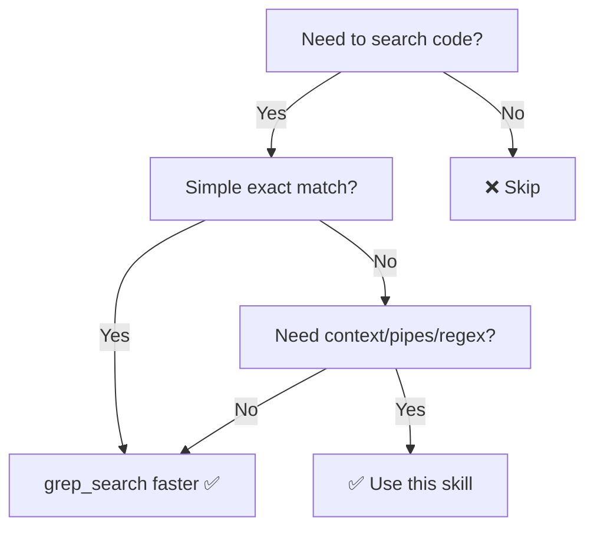

# rg: Fast Code Search

Fast code search using ripgrep via terminal. Respects `.gitignore` automatically.

## When to Use This Skill



Use this skill when you need to:
- Search for patterns across multiple files in the codebase
- Find class, method, or interface definitions
- Locate specific annotations, attributes, or decorators
- Analyze code patterns across the entire workspace
- Perform complex regex searches with context lines
- Search in specific file types (e.g., only .cs files)
- Count occurrences or list files containing a pattern

**Prefer rg over grep_search when:**
- You need context lines around matches
- You need word boundary matching
- You want to pipe results to other commands
- You need advanced regex capabilities
- You're searching across many files with complex patterns

**Not for:** Simple exact string searches (use grep_search for better performance)

## Quick Reference

```bash
# Type: -t cs (C#), -t py, -t js, -t ts, -t md, -t yaml, -t csproj
rg '\[HttpGet\]' -t cs

# Flags
rg -l 'pattern'         # Files only
rg -c 'pattern'         # Count
rg -w 'word'            # Word boundaries
rg -F 'literal('        # No regex
rg -i 'case'            # Ignore case
rg -A 2 -B 2 'ctx'      # Context lines

# Exclude & pipes
rg 'p' -g '!*.min.js'   # Glob exclude
rg 'TODO' | wc -l       # Count total
```

## C#/.NET Patterns

```bash
rg '\[(ApiController|HttpGet|Authorize)\]' -t cs  # Attributes
rg '^(public|internal) (class|interface) \w+' -t cs  # Types
rg 'AddScoped|AddSingleton|AddTransient' -t cs  # DI
rg 'async Task|await ' -t cs  # Async
```

## Core Principle

One-shot results with context and line numbers. Respects `.gitignore` (no need to exclude `bin/obj/`).
